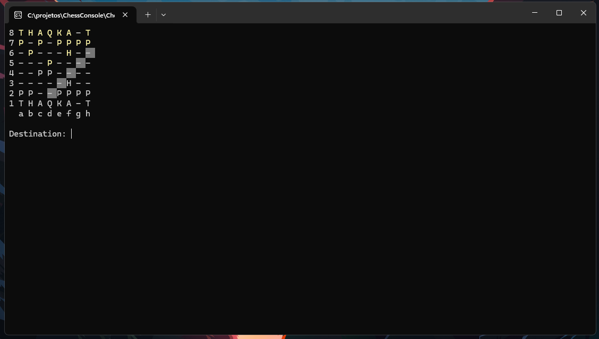
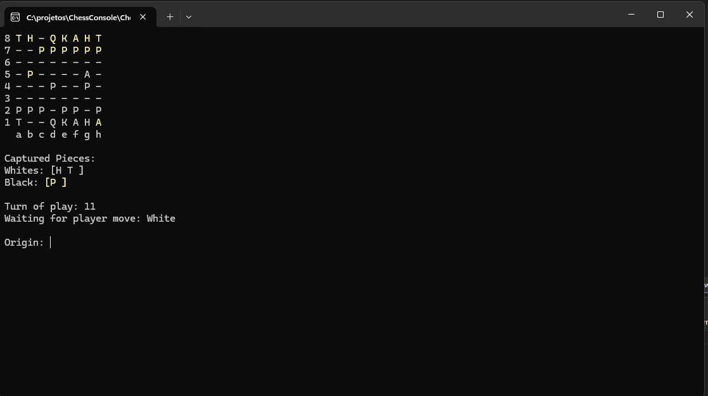

# Chess System - C# Console ♟️

[](https://dotnet.microsoft.com/)

Este não é apenas um jogo de xadrez, mas um estudo aprofundado sobre **Engenharia de Software**, focado em **Programação Orientada a Objetos (POO)** e **Arquitetura de Camadas**.

## Objetivo do Projeto
O foco principal foi transpor a complexidade das regras do xadrez para um sistema estruturado, priorizando o desacoplamento entre a lógica de negócio e a interface de usuário.

## Demonstração de Execução

Abaixo, uma demonstração da partida em andamento, destacando o sistema de validação de movimentos:
* **Cenário:** Partida avançada com múltiplas peças posicionadas.
* **Funcionalidade:** Ao selecionar uma peça (ex: Torre em destaque), o sistema mapeia e colore os movimentos possíveis no console, respeitando obstáculos e regras de captura.


*Interface de console renderizando o tabuleiro e as possibilidades de jogada da peça selecionada.*


*Interface de console exibindo as informações da partida como peças capturadas, turno da partida e qual o jogador atual.*


## Arquitetura
O sistema foi dividido em três camadas principais:
1.  **Camada de Tabuleiro (Board):** Responsável pela estrutura física, manipulação de matrizes e posicionamento de peças.
2.  **Camada de Partida de Xadrez (Chess Match):** Onde reside a inteligência do jogo. Contém as regras específicas de cada peça, validações de movimentos e estados de jogo (Xeque, Xeque-Mate e jogadas especiais).
3. **Camada de Tela (Screen Game):** Responsável pela interação com o usuário durante toda a execução da partida.

### Visualização da Estrutura (UML)
Para garantir o desacoplamento e a correta aplicação dos pilares da POO, a estrutura de classes foi desenhada conforme o diagrama abaixo:


## Desafios Técnicos Solucionados
* **Polimorfismo Avançado:** Implementação de movimentos genéricos na classe abstrata `Piece`, onde cada subclasse (Tower, Bishop, etc.) define sua própria lógica de alcance.
* **Gestão de Estado de Jogo:** Lógica para detecção de Xeque e Xeque-mate, exigindo a simulação preventiva de movimentos e reversão de estado (Undo Movement).
* **Jogadas Especiais:** Implementação das regras de *Roque*, *En Passant* e *Promoção*, garantindo a integridade das regras originais do jogo.
* **Tratamento de Exceções:** Criação de exceções personalizadas para capturar erros de input ou jogadas ilegais, garantindo a resiliência da aplicação.

## Tecnologias e Conceitos Aplicados
- **Linguagem:** C#
- **Framework:** .NET 8.0
- **Conceitos:** SOLID (SRP, OCP), Encapsulamento, Herança, Polimorfismo e Composição.

## Como rodar o projeto
1. Clone o repositório:
   ```bash
   git clone https://github.com/luismarcano537/Chess---Console-App..git
   ```
2. Entre na pasta do projeto:
    ```
   cd ChessConsole
    ```
3. Execute a aplicação: 
    ```
    dotnet run
    ```

### Desenvolvido por Luis Marcano - Projeto desenvolvido para consolidação de conceitos avançados de POO no ecossistema .NET.

## 🤝 Contato

Conecte-se comigo para propostas de melhorias, dúvidas ou colaborações:

**LinkedIn:** [Luis Marcano](https://www.linkedin.com/in/luis-marcano537/)